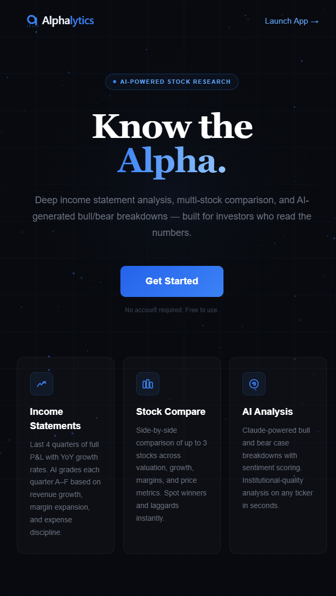
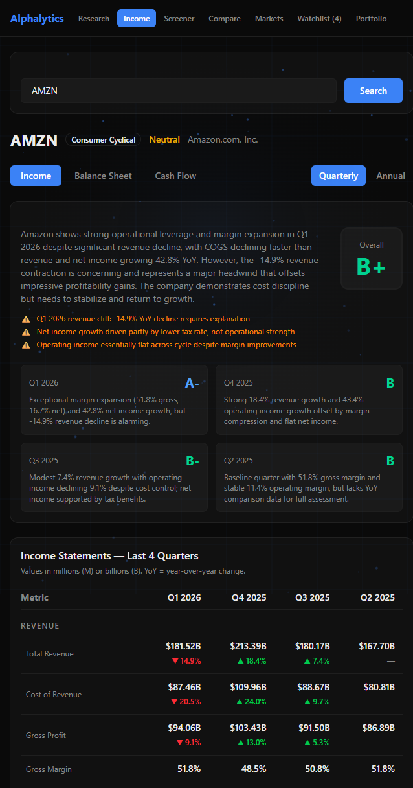
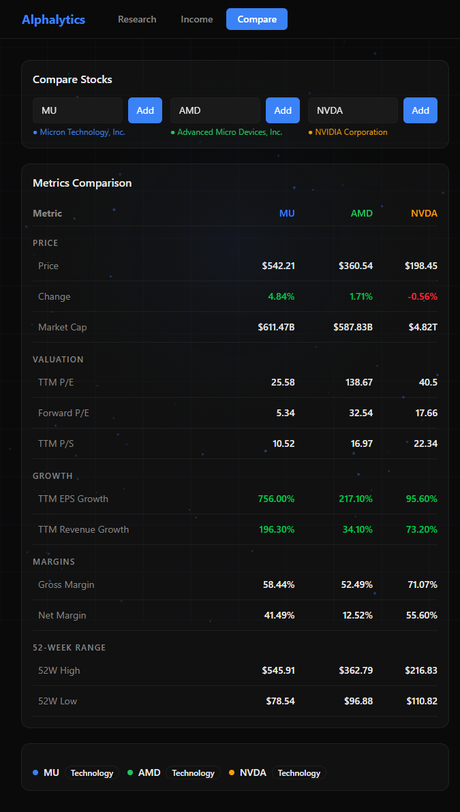
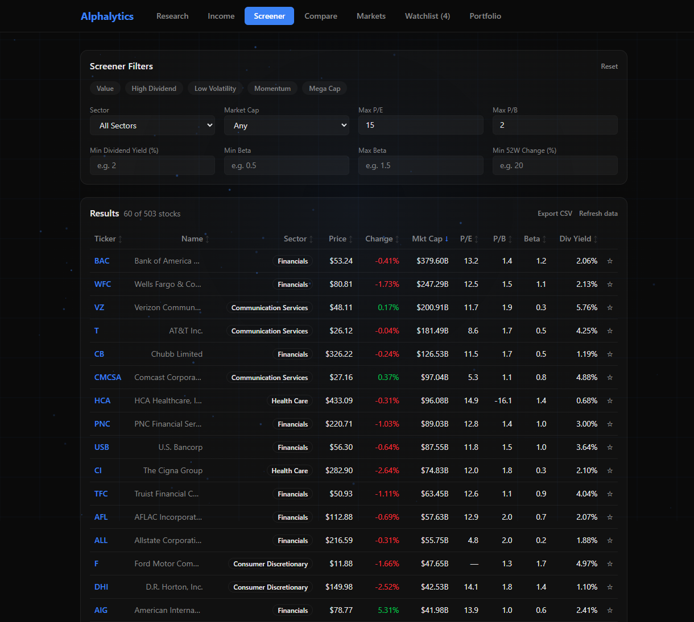
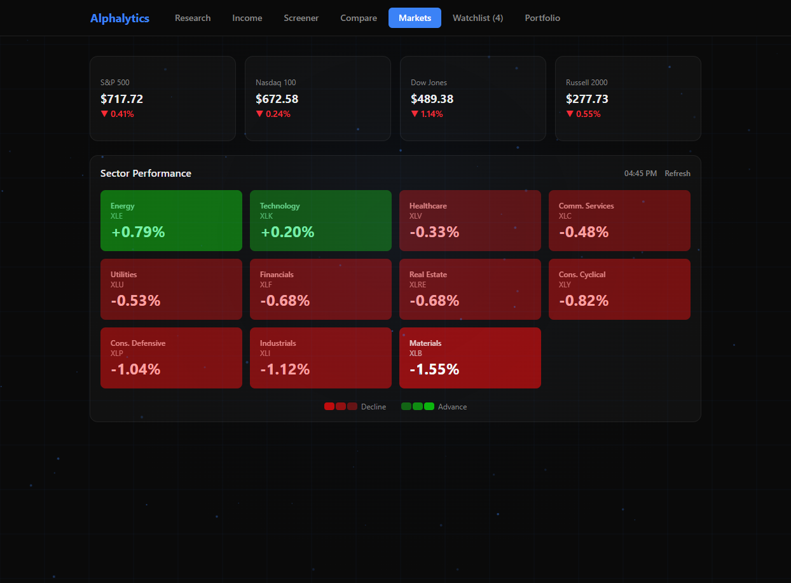
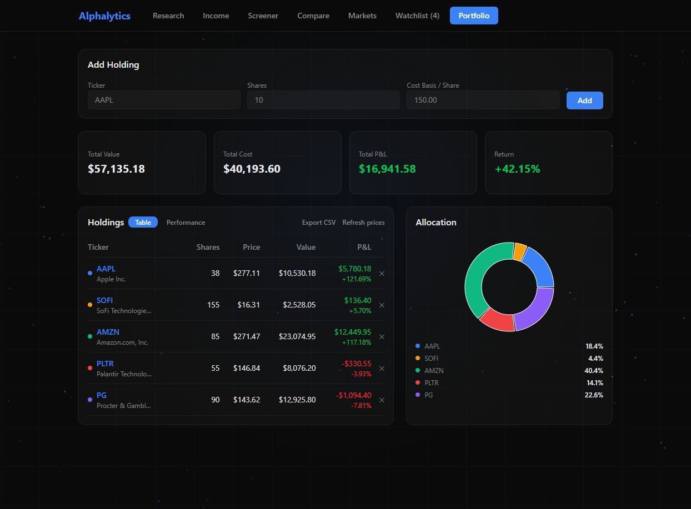

<p align="center">
  <strong>AI-powered stock research &amp; portfolio platform</strong><br/>
  Income grading, multi-stock comparison, screener, watchlist, portfolio tracker, and sector heatmap — all in one dark-mode dashboard.
</p>

<p align="center">
  🔗 <a href="https://alphalytics-theta.vercel.app"><strong>alphalytics-theta.vercel.app</strong></a>
</p>

---



---

## Features

### 📊 Income Statement Analysis
- Last 4 quarters of full P&L with year-over-year growth rates
- AI grades each quarter **A–F** based on revenue growth, margin expansion, and expense discipline
- Overall grade with flags for one-time items, tax anomalies, and unusual patterns
- Bullish / bearish / neutral sentiment per ticker



### ⚖️ Stock Compare
- Side-by-side comparison of up to 3 stocks
- Grouped metrics: Valuation, Growth, Margins, 52-Week Range
- YoY growth indicators per metric



### 🔍 Stock Research
- Search 10,000+ tickers with live autocomplete and recent-searches history
- Price, market cap, P/E, Forward P/E, P/S, gross margin, net margin, EPS growth, revenue growth
- **52-week range bar** — visual high/low position indicator
- 1-year price chart and quarterly revenue chart
- **Earnings history** — quarterly EPS vs. estimate chart
- **Analyst ratings** — consensus price target, buy/hold/sell counts
- **Insider transactions** — recent insider buy/sell activity
- **News feed** — latest headlines for the ticker
- Claude-powered bull case / bear case breakdown on demand

### 🔎 Stock Screener
- 500+ S&P 500 stocks, refreshed and cached daily
- Filter by sector, market cap tier, P/E, P/B, dividend yield, beta, 52-week change
- **5 one-click presets** — Value, High Dividend, Low Volatility, Momentum, Mega Cap
- Sortable columns; watchlist stars inline
- **CSV export** of filtered results



### ⭐ Watchlist
- Star any ticker from Search, Screener, or the Watchlist tab
- Live prices and day-change % for all watched tickers
- Persisted to `localStorage` — survives page reloads

### 🌡️ Markets (Sector Heatmap)
- Color-coded heat tiles for all 11 SPDR sector ETFs
- Index summary bar — SPY, QQQ, DIA, IWM with live prices and day change
- Tiles sorted by performance; intensity scales with magnitude



### 💼 Portfolio Tracker
- Add holdings with ticker autocomplete, share count, and cost basis
- Real-time P&L: dollar and percent return per position
- **Allocation donut chart** — portfolio weight per holding
- **Performance chart** — portfolio % return vs. SPY over 12 months
- **CSV export** of full holdings with P&L
- Persisted to `localStorage`



---

## UX & Quality

- **Keyboard shortcuts** — `/` to focus search, `Escape` to clear, `↑ ↓` to navigate autocomplete, `Enter` to confirm
- **Toast notifications** — non-blocking feedback for watchlist / portfolio actions
- **Error boundaries** — each tab is isolated; a render crash shows a friendly fallback with a "Try again" button rather than a blank screen
- **Rate-limit UX** — 429 responses show a draining countdown bar that auto-retries when it hits 0
- **Empty state illustrations** — custom SVG placeholders on Watchlist and Portfolio
- **Mobile-responsive** — fluid grid layouts down to small screens

---

## Tech Stack

**Frontend**
- React 19 + TypeScript + Vite
- Tailwind CSS v4 + shadcn/ui
- Recharts
- Deployed on **Vercel**

**Backend**
- FastAPI (Python 3.13)
- yfinance — market data
- Anthropic Claude API (`claude-haiku-4-5`) — AI analysis + income grading
- Redis — caching (tickers 24 hr, stock data 15 min, analysis 1 hr, screener 24 hr)
- slowapi — rate limiting (5–10 req/min per endpoint)
- Deployed on **Railway**

---

## Architecture

```
┌─────────────────┐         ┌──────────────────┐         ┌──────────────┐
│  React Frontend  │ ──────▶ │  FastAPI Backend  │ ──────▶ │   yfinance   │
│   (Vercel)       │         │  (Railway)        │         │  Yahoo API   │
└─────────────────┘         └──────────────────┘         └──────────────┘
                                      │
                         ┌────────────┼────────────┐
                         │            │             │
                    ┌────▼────┐  ┌────▼────┐  ┌────▼──────┐
                    │  Redis  │  │Anthropic│  │ screener  │
                    │  Cache  │  │ Claude  │  │ (cached)  │
                    └─────────┘  └─────────┘  └───────────┘
```

**Backend modules**

| Module | Responsibility |
|--------|---------------|
| `main.py` | App setup, routing, quotes, history endpoints |
| `screener.py` | S&P 500 screener data build + cache |
| `financials.py` | Income / balance sheet / cash flow parsing |
| `ai.py` | Claude integration — analysis + income grading |
| `auth.py` | Bearer token verification |
| `db.py` | Redis connection |

---

## Local Development

### Option A — Docker (recommended)

```bash
cp .env.example .env          # fill in your keys
docker compose up --build
```

- Frontend → http://localhost:5173
- Backend  → http://localhost:8000
- Redis is included in the compose file; no separate install needed.

### Option B — Manual

**Prerequisites:** Python 3.13+, Node 24+, Redis on `localhost:6379`

**Backend**

```bash
cd backend
pip install -r requirements.txt
```

Create `backend/.env.development`:
```env
ENV=development
API_SECRET_TOKEN=your_token
ANTHROPIC_API_KEY=your_key
ANTHROPIC_MODEL=claude-haiku-4-5
```

```bash
uvicorn main:app --reload
```

**Frontend**

```bash
cd frontend
npm install
```

Create `frontend/.env.development`:
```env
VITE_API_URL=http://127.0.0.1:8000
VITE_API_SECRET_TOKEN=your_token
```

```bash
npm run dev
```

---

## API Endpoints

| Method | Endpoint | Description |
|--------|----------|-------------|
| GET | `/stock/{ticker}` | Stock data + price chart |
| GET | `/income/{ticker}` | Quarterly income statements + AI grades |
| GET | `/balance/{ticker}` | Balance sheet quarters |
| GET | `/cashflow/{ticker}` | Cash flow quarters |
| GET | `/earnings/{ticker}` | Earnings history (EPS vs estimate) |
| GET | `/analyst/{ticker}` | Analyst ratings + price targets |
| GET | `/insider/{ticker}` | Insider transactions |
| GET | `/news/{ticker}` | Recent news headlines |
| POST | `/analyze` | AI bull/bear analysis |
| GET | `/tickers` | Full ticker list for autocomplete |
| GET | `/quotes` | Batch real-time quotes |
| GET | `/history` | Batch 12-month price history |
| GET | `/screener/data` | Screener dataset (cached 24 hr) |

All endpoints require `Authorization: Bearer <token>`.

---

## Security

- Bearer token authentication on all endpoints
- Rate limiting via slowapi (5–10 req/min per endpoint, returns `429` + `Retry-After`)
- Prompt injection protection on AI endpoints
- All secrets in environment variables, never in code
